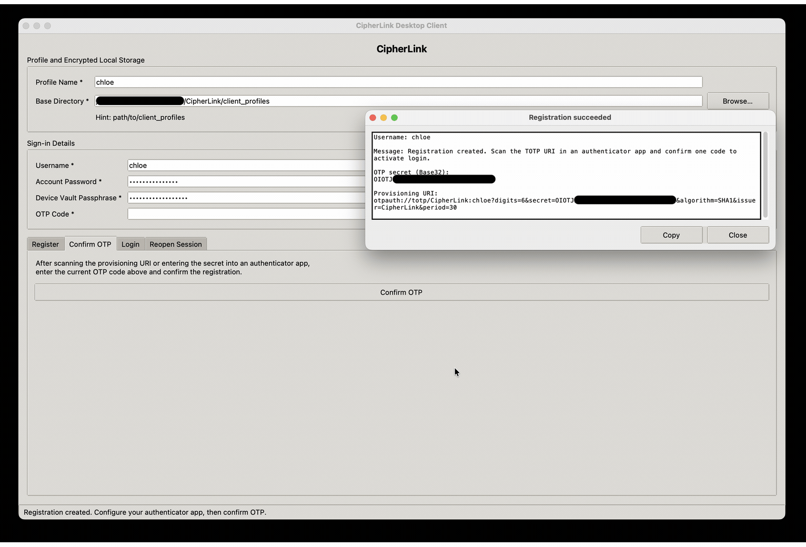
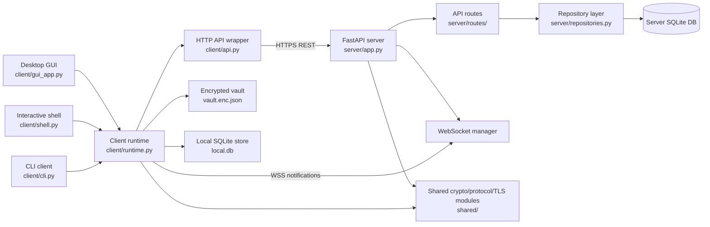

# CipherLink

CipherLink is a Python client/server secure messaging project focused on 1:1 encrypted communication, contact verification, offline message delivery, and practical deployment with TLS.

> The repository contains a FastAPI HTTPS/WSS server, a command-line client, an interactive shell, and a Tkinter desktop GUI.

## Author
[Chloe Xin DAI](https://github.com/PhDinTimeManagement) <br>

## Project Demo
Note: The demo GIF is high-resolution and may take a few moments to load.
<p align="center">
  
</p>

## Repository Structure

```text
CipherLink
│
├── client/                 CLI, shell, GUI, profile vault, local store, client runtime
├── server/                 FastAPI app, routes, DB layer, repository, security helpers
├── shared/                 Protocol models, crypto helpers, TLS helpers, trust logic
├── scripts/                TLS generation, DB initialization, server startup, bootstrap creation
├── db/                     SQL files and generated runtime DB files
├── docs/                   Security, deployment, architecture, and protocol documentation
├── certs_dev/              Generated localhost TLS material; do not commit generated files
├── certs_network/          Generated network TLS/CA material; do not commit generated files
├── client_bootstrap/       Generated client bootstrap bundles; do not commit generated files
└── requirements.txt        Python dependencies
```

## Key Features

- 1:1 encrypted messaging between registered users.
- Password plus TOTP authentication.
- Argon2id password hashing.
- Ed25519 identity keys and X25519 chat/agreement keys.
- Signed public key bundles with SHA-256 safety-number fingerprints.
- Client-side end-to-end message encryption.
- Friend request, accept, decline, cancel, block, unblock, and remove workflows.
- Mutual contact fingerprint verification before chat messages are accepted.
- Offline store-and-forward ciphertext queue.
- WebSocket notifications for online clients.
- Read/delivery acknowledgement envelopes encrypted end-to-end.
- Optional disappearing-message TTL.
- Encrypted local client vault for private keys and session token.
- Locally encrypted message bodies in the client SQLite store.
- Development TLS certificate generation and private-CA network deployment scripts.

## Security-Focused Features

CipherLink uses the following security mechanisms in the current implementation:

| Area | Implementation |
|---|---|
| Transport security | HTTPS and WSS with certificate validation. |
| Account authentication | Password plus TOTP. |
| Password storage | Argon2id through `argon2-cffi`. |
| TOTP seed storage | Server-side ChaCha20-Poly1305 encryption under a generated server master key. |
| Identity keys | Ed25519 client identity keypair. |
| Chat key agreement | X25519 client keypair. |
| Message encryption | X25519 shared secret, HKDF-SHA256, ChaCha20-Poly1305. |
| Message integrity | Canonical message header is AEAD associated data. |
| Contact verification | Safety-number/fingerprint verification, stored locally and server-side. |
| Local client vault | Scrypt-derived key plus ChaCha20-Poly1305. |
| Replay resistance | Message IDs and sender/conversation counters are tracked. |

See [`docs/SECURITY_ANALYSIS.md`](docs/SECURITY_ANALYSIS.md) for the full security analysis and limitations.

## Architecture Overview


See [`docs/ARCHITECTURE_AND_API_PROTOCOL.md`](docs/ARCHITECTURE_AND_API_PROTOCOL.md) for the full architecture and API protocol documentation.

## Deployment Documentation

- Deployment guide: [`docs/DEPLOYMENT.md`](docs/DEPLOYMENT.md)

## Important Publish-Safety Warning

Do **not** commit generated secrets or runtime state.

At minimum, remove and ignore:

```text
certs_dev/*
certs_network/*
db/cipherlink.sqlite3
db/server_master.key
client_profiles/
client_bootstrap/*
.idea/
.env
```

Generated private keys, CA keys, server master keys, databases, and client profiles must be regenerated per deployment.

## Security Notes

- The server never receives client private messaging keys.
- Message plaintext is encrypted before upload.
- The server still sees metadata such as usernames, contact relationships, timestamps, ciphertext size, key fingerprints, and queue/delivery state.
- Contact fingerprints must be verified out of band.
- Disappearing messages are best-effort only. Screenshots, modified clients, and copied plaintext cannot be prevented.
- This implementation does not include a Signal-style double ratchet or post-compromise security.
- SQLite is used for a simple single-server deployment model.
- The WebSocket currently authenticates with a token in the query string; avoid enabling verbose access logs in deployments where URLs may be logged.
