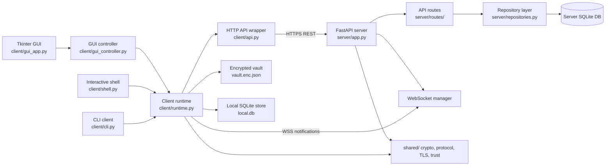

# CipherLink


CipherLink is a Python client/server secure messaging project for one-to-one encrypted communication. It includes a FastAPI HTTPS/WSS server, a command-line client, an interactive terminal shell, and a Tkinter desktop GUI.

> The repository focuses on practical secure-messaging workflows: password plus TOTP authentication, signed client key bundles, contact verification by safety number, client-side message encryption, offline ciphertext queueing, WebSocket notifications, local encrypted client profiles, and TLS bootstrap tooling for local or network deployments.

## Author
[Chloe Xin DAI](https://github.com/PhDinTimeManagement) <br>

## Project Demo
Note: The demo GIF is high-resolution and may take a few moments to load.
<p align="center">
  
</p>

## Key Features

- Account registration with password plus TOTP activation.
- Login sessions stored locally in an encrypted client vault.
- One-off CLI commands, an interactive terminal shell, and a Tkinter desktop GUI.
- Friend request, accept, decline, cancel, block, unblock, and remove workflows.
- Safety-number display and explicit contact verification before normal chat messages are accepted.
- Key rotation with local and server-side re-verification requirements.
- Offline sync through a server-side ciphertext queue.
- WebSocket notifications for online clients.
- Read/delivery acknowledgement envelopes encrypted like normal messages.
- Optional disappearing-message TTL from 1 to 86,400 seconds.

## Security-Focused Features

CipherLink uses the following security mechanisms in the current implementation:

| Area | Implementation |
|---|---|
| Transport security | HTTPS and WSS with certificate validation. |
| Account authentication | Password plus TOTP. |
| Password storage | Argon2id through `argon2-cffi`. |
| TOTP seed storage | Server-side ChaCha20-Poly1305 encryption under a generated server master key. |
| Identity keys | Ed25519 client identity keypair. |
| Chat key agreement | X25519 client keypair. |
| Message encryption | X25519 shared secret, HKDF-SHA256, ChaCha20-Poly1305. |
| Message integrity | Canonical message header is AEAD associated data. |
| Contact verification | Safety-number/fingerprint verification, stored locally and server-side. |
| Local client vault | Scrypt-derived key plus ChaCha20-Poly1305. |
| Replay resistance | Message IDs and sender/conversation counters are tracked. |

See [`docs/SECURITY_ANALYSIS.md`](docs/SECURITY_ANALYSIS.md) for the full security analysis and limitations.

## Tech Stack

| Area | Technology |
|---|---|
| Language | Python 3.11+ |
| Server | FastAPI, Uvicorn |
| HTTP client | httpx |
| WebSockets | `websockets` |
| Data validation | Pydantic v2 |
| Databases | SQLite on server and client |
| GUI | Tkinter / ttk |
| Cryptography | `cryptography`, `argon2-cffi` |
| TLS | Development self-signed certs and private-CA network cert tooling |

## Repository Structure

```text
CipherLink
├── client/                 # CLI, shell, GUI, runtime, local profile/vault, local store
├── server/                 # FastAPI app, routes, database layer, repositories, security helpers
├── shared/                 # Protocol models, crypto helpers, TLS helpers, trust logic, utilities
├── scripts/                # TLS generation, DB initialization, server startup, bootstrap creation
├── db/                     # SQL schema copies and migration seed files
├── docs/                   # Architecture, API protocol, deployment, and security documentation
├── media/                  # Demo GIF/MP4, screenshots, and extracted frames
├── requirements.txt        # Python runtime dependencies
├── LICENSE                 
└── README.md
```

## Architecture Overview



See [`docs/ARCHITECTURE_AND_API_PROTOCOL.md`](docs/ARCHITECTURE_AND_API_PROTOCOL.md) for the complete architecture and protocol description.

## Deployment Documentation

Deployment guide: [`docs/DEPLOYMENT.md`](docs/DEPLOYMENT.md)

## Important Publish-Safety Warning

Do **not** commit generated secrets or runtime state.

At minimum, remove and ignore:

```text
certs_dev/*
certs_network/*
db/cipherlink.sqlite3
db/server_master.key
client_profiles/
client_bootstrap/*
.idea/
.env
```

Generated private keys, CA keys, server master keys, databases, and client profiles must be regenerated per deployment.

## Security Notes

- The server never receives client private messaging keys.
- Message plaintext is encrypted before upload.
- The server still sees metadata such as usernames, contact relationships, timestamps, ciphertext size, key fingerprints, and queue/delivery state.
- Contact fingerprints must be verified out of band.
- Disappearing messages are best-effort only. Screenshots, modified clients, and copied plaintext cannot be prevented.
- This implementation does not include a Signal-style double ratchet or post-compromise security.
- SQLite is used for a simple single-server deployment model.
- The WebSocket currently authenticates with a token in the query string; avoid enabling verbose access logs in deployments where URLs may be logged.
