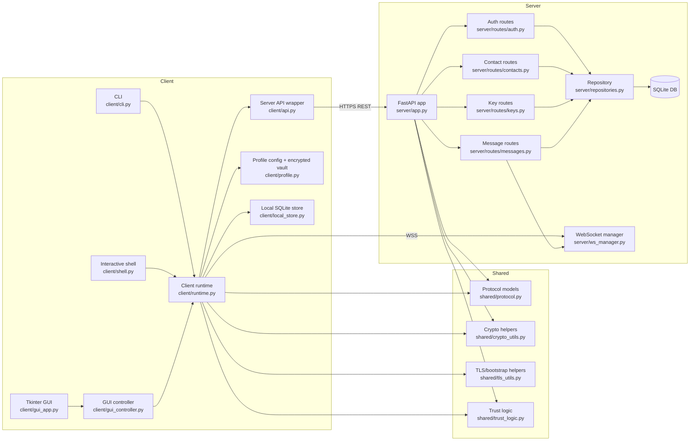
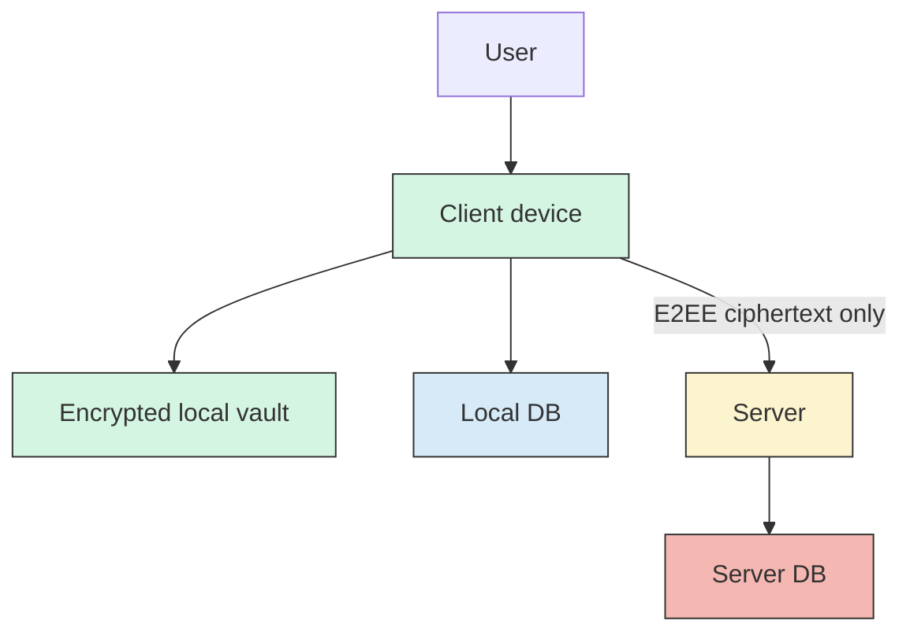
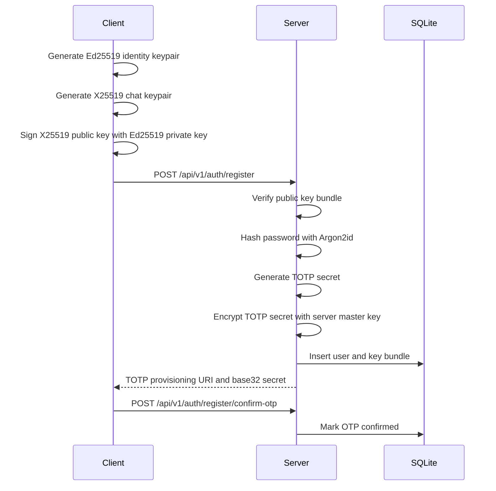
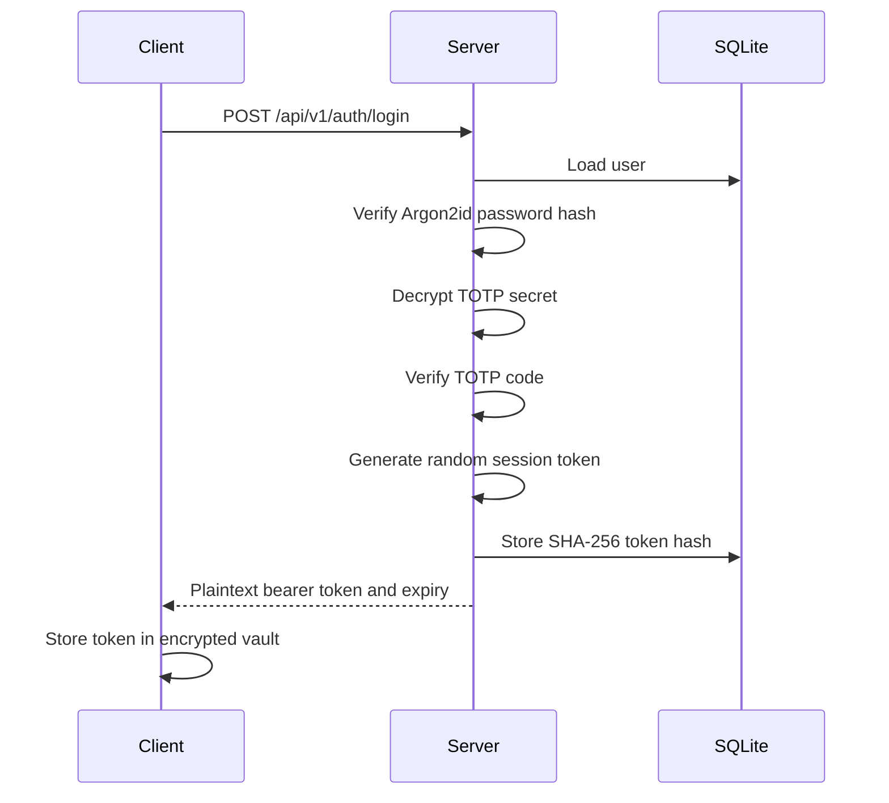
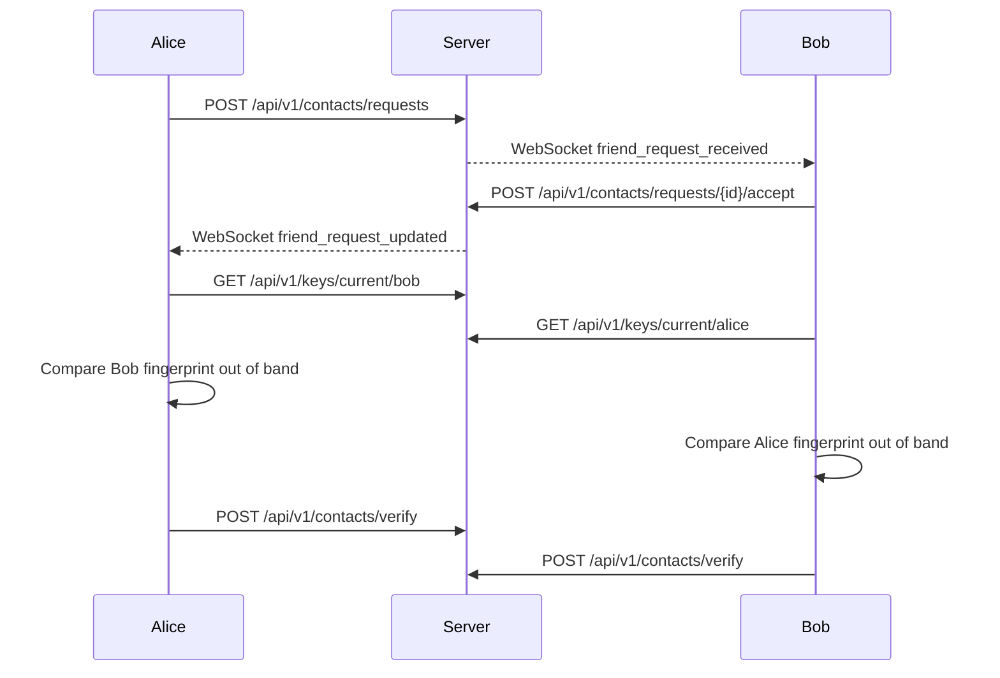
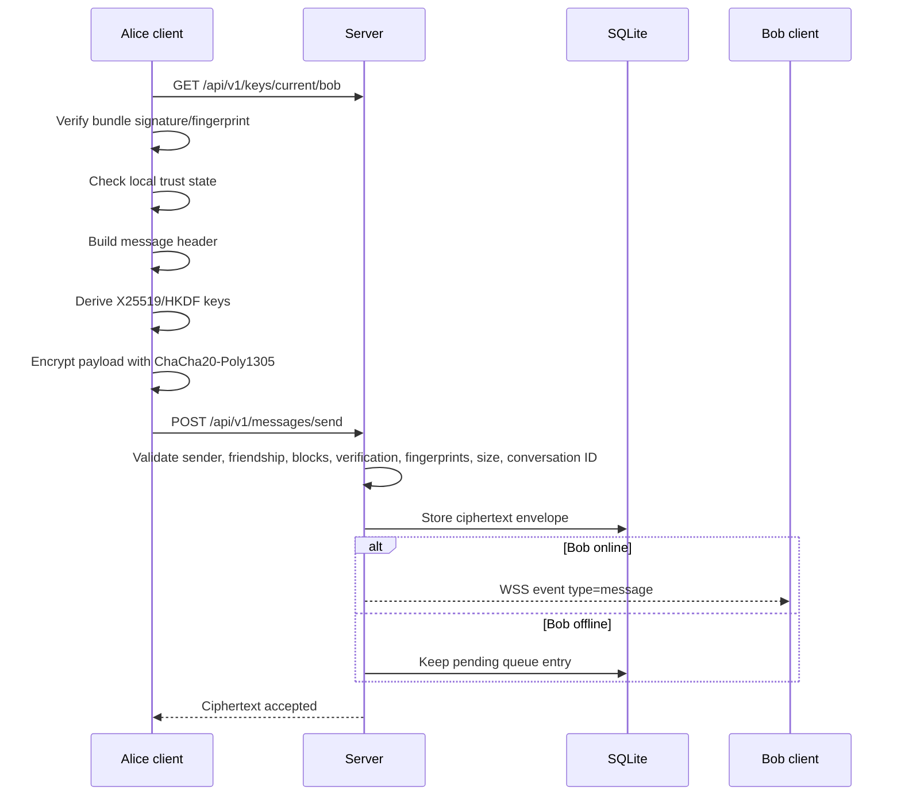
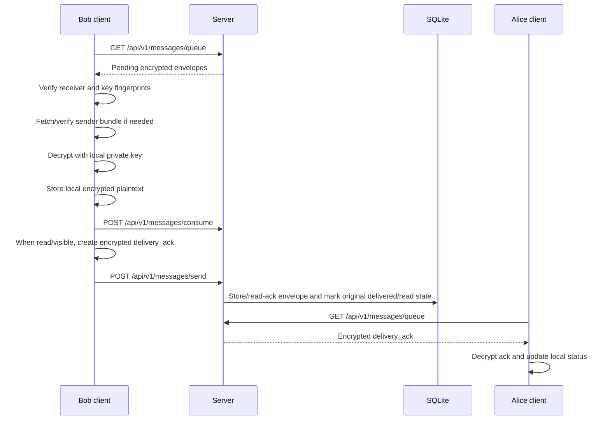

# Architecture and API Protocol

This document describes CipherLink’s architecture and protocol based on the current implementation.

## 1. High-Level Architecture



## 2. Main Components

| Component | Path | Responsibility |
|---|---|---|
| Server app | `server/app.py` | FastAPI app, router registration, lifespan cleanup task, WebSocket endpoint. |
| Server settings | `server/config.py` | Default paths, environment overrides, retention and limit settings. |
| Database layer | `server/db.py` | SQLite connection, schema initialization, compatibility migrations. |
| Repository | `server/repositories.py` | User, session, key bundle, contact, verification, block, and message persistence. |
| Auth routes | `server/routes/auth.py` | Registration, OTP confirmation, login, logout, `/me`. |
| Contact routes | `server/routes/contacts.py` | Contacts, friend requests, verification, block/unblock/remove. |
| Key routes | `server/routes/keys.py` | Current/historical public key bundles and key rotation. |
| Message routes | `server/routes/messages.py` | Send, queue fetch, consume. |
| WebSocket manager | `server/ws_manager.py` | In-memory online connection tracking and event delivery. |
| Client runtime | `client/runtime.py` | High-level client operations and message processing. |
| API wrapper | `client/api.py` | HTTPS requests, bearer token handling, response/error normalization. |
| Local vault/profile | `client/profile.py` | Profile config, CA trust, encrypted vault, private keys, session token. |
| Local store | `client/local_store.py` | Local SQLite tables, encrypted local message bodies, replay cache, security events. |
| CLI | `client/cli.py` | One-off command-line interface. |
| Shell | `client/shell.py` | Interactive terminal client with WebSocket listener. |
| GUI | `client/gui_app.py`, `client/gui_controller.py` | Tkinter desktop UI and controller wrapper. |
| Protocol models | `shared/protocol.py` | Pydantic request/response/envelope models. |
| Crypto helpers | `shared/crypto_utils.py` | Key generation, bundle verification, E2EE encryption/decryption. |
| TLS helpers | `shared/tls_utils.py` | CA fingerprinting, HTTPS URL validation, bootstrap loading. |
| Trust logic | `shared/trust_logic.py` | Verification-state and messaging-availability decisions. |

## 3. Data Stores

### Server SQLite Database

The canonical runtime schema is:

```text
server/schema.sql
```

Tables:

| Table | Purpose |
|---|---|
| `users` | Account records, password hashes, encrypted TOTP secrets, active key fingerprint. |
| `key_bundles` | Active and historical public key bundles. |
| `sessions` | Hashed bearer session tokens, expiry, revocation, last-seen time. |
| `friend_requests` | Pending/accepted/declined/cancelled friend requests. |
| `friendships` | Accepted or removed friend relationships. |
| `blocks` | Block relationships. |
| `contact_verifications` | Per-user verification of another user’s active key fingerprint. |
| `messages` | Encrypted envelopes, routing metadata, counters, TTL, delivery/consume/delete state. |

### Client Profile Directory

Default profile path:

```text
client_profiles/<profile>/
```

Files:

| File | Purpose |
|---|---|
| `profile.json` | Server URL and trusted CA certificate metadata. |
| `trusted_server_ca.crt` | CA certificate copied into the profile. |
| `vault.enc.json` | Encrypted client vault. |
| `local.db` | Local encrypted-message and metadata store. |

The local vault stores private keys, session token, active key fingerprint, and the local message storage key.

## 4. Trust Boundaries



| Boundary | Trust assumption |
|---|---|
| Client private keys | Trusted to remain local to the client profile. |
| Local vault passphrase | Trusted secret chosen by the user. |
| Server | Trusted for routing and account workflow, not trusted with message plaintext. |
| Server database | Not trusted for message confidentiality. It contains ciphertext and metadata. |
| Public key directory | Server-provided; users must verify fingerprints out of band. |
| TLS bootstrap bundle | Trust anchor for the server’s certificate chain in controlled deployments. |

## 5. Registration Flow



Registration does not create an immediately usable login until OTP is confirmed.

## 6. Login/Session Flow



REST requests use:

```text
Authorization: Bearer <session-token>
```

The server stores only the token hash.

## 7. Contact and Verification Flow



Accepted friendship alone is not enough for chat messages. Both sides must have acceptable verification state for the other side’s current active fingerprint.

## 8. Message send Flow



The server does not decrypt message payloads.

## 9. Message Receive and Acknowledgement Flow



The `delivery_ack` envelope is encrypted like a normal message and references the original `message_id`.

## 10. Public Key Bundle Format

Model: `shared.protocol.PublicKeyBundle`

```json
{
  "username": "alice",
  "fingerprint": "64 lowercase hex characters",
  "identity_public_key": "base64(raw Ed25519 public key)",
  "chat_public_key": "base64(raw X25519 public key)",
  "signature": "base64(Ed25519 signature over raw X25519 public key)",
  "created_at": "2026-01-01T00:00:00Z",
  "is_active": true
}
```

Bundle fingerprint:

```text
SHA256(identity_public_key || chat_public_key)
```

## 11. Message Envelope Format

Model: `shared.protocol.MessageEnvelope`

```json
{
  "header": {
    "payload_version": 1,
    "message_id": "random 128-bit hex string",
    "conversation_id": "sha256(sorted usernames) truncated to 32 hex characters",
    "sender": "alice",
    "receiver": "bob",
    "kind": "chat",
    "counter": 1,
    "sender_key_fingerprint": "64 lowercase hex characters",
    "receiver_key_fingerprint": "64 lowercase hex characters",
    "created_at": "2026-01-01T00:00:00Z",
    "expires_at": null,
    "ttl_seconds": null,
    "related_message_id": null
  },
  "nonce": "base64(12 random bytes)",
  "ciphertext": "base64(ChaCha20-Poly1305 ciphertext and tag)",
  "submitted_at": null,
  "canonical_expires_at": null
}
```

The server may add `submitted_at` and `canonical_expires_at` when returning or pushing queued messages.

## 12. Authenticated Associated Data

The canonical JSON header is used as AEAD associated data.

Authenticated header fields include:

- payload version;
- message ID;
- conversation ID;
- sender;
- receiver;
- message kind;
- counter;
- sender key fingerprint;
- receiver key fingerprint;
- created time;
- expiry/TTL fields;
- related message ID.

Header fields are visible to the server but protected against undetected tampering.

## 13. Bootstrap Bundle Format

Created by `scripts/create_client_bootstrap.py`.

```json
{
  "version": 1,
  "server_url": "https://192.168.1.50:8443",
  "ca_cert_filename": "server_ca.crt",
  "ca_cert_sha256": "64 lowercase hex characters",
  "created_at": "2026-01-01T00:00:00Z",
  "description": "CipherLink remote client bootstrap bundle"
}
```

The CA certificate file is stored next to the bootstrap JSON. The client checks that the CA certificate hash matches `ca_cert_sha256`.

## 14. REST API Overview

Base path:

```text
/api/v1
```

### Health

| Method | Path | Auth | Purpose |
|---|---|---|---|
| `GET` | `/healthz` | No | Health check. |

### Authentication

| Method | Path | Auth | Request model | Response |
|---|---|---|---|---|
| `POST` | `/auth/register` | No | `RegisterRequest` | TOTP setup and registration message. |
| `POST` | `/auth/register/confirm-otp` | No | `RegistrationOTPConfirmRequest` | Confirmation message. |
| `POST` | `/auth/login` | No | `LoginRequest` | Bearer token, expiry, username, active key fingerprint. |
| `POST` | `/auth/logout` | Yes | none | Revokes current session and closes WebSockets. |
| `GET` | `/auth/me` | Yes | none | Authenticated username message. |

### Key Management

| Method | Path | Auth | Purpose |
|---|---|---|---|
| `GET` | `/keys/current/{username}` | Yes | Fetch active public key bundle. |
| `GET` | `/keys/by-fingerprint/{username}/{fingerprint}` | Yes | Fetch active or historical bundle by fingerprint. |
| `POST` | `/keys/rotate` | Yes | Upload a new active public key bundle for the authenticated user. |

### Contacts

| Method | Path | Auth | Purpose |
|---|---|---|---|
| `GET` | `/contacts` | Yes | List accepted contacts and verification/block state. |
| `POST` | `/contacts/verify` | Yes | Record verification of a contact’s current fingerprint. |
| `POST` | `/contacts/requests` | Yes | Send friend request. |
| `GET` | `/contacts/requests` | Yes | List incoming/outgoing friend requests. |
| `POST` | `/contacts/requests/{request_id}/accept` | Yes | Accept incoming request. |
| `POST` | `/contacts/requests/{request_id}/decline` | Yes | Decline incoming request. |
| `POST` | `/contacts/requests/{request_id}/cancel` | Yes | Cancel outgoing request. |
| `POST` | `/contacts/block` | Yes | Block a user. |
| `POST` | `/contacts/unblock` | Yes | Unblock a user. |
| `POST` | `/contacts/remove` | Yes | Remove accepted contact and clear local relationship state server-side. |

### Messages

| Method | Path | Auth | Purpose |
|---|---|---|---|
| `POST` | `/messages/send` | Yes | Submit encrypted `MessageEnvelope`. |
| `GET` | `/messages/queue` | Yes | Fetch pending encrypted envelopes for current user. |
| `POST` | `/messages/consume` | Yes | Mark one queued message consumed/deleted for current receiver. |

`GET /messages/queue` accepts:

| Query | Meaning |
|---|---|
| `limit` | Number of messages, 1 to 100, default 50. |
| `cursor` | Pagination cursor based on submitted timestamp. |

## 15. WebSocket Protocol

Endpoint:

```text
/api/v1/ws?token=<session-token>
```

The server authenticates the token by hashing it and looking it up in `sessions`.

Supported client message:

```json
{ "type": "ping" }
```

Server events use:

```json
{
  "type": "event_type",
  "payload": {}
}
```

Known event types:

| Event type | Purpose |
|---|---|
| `connected` | Initial connection acknowledgement with username and pending count. |
| `pong` | Response to ping. |
| `message` | New encrypted message envelope available. |
| `friend_request_received` | Incoming friend request notification. |
| `friend_request_updated` | Friend request accepted/declined/cancelled notification. |
| `security_notice` | Reserved protocol event type in model. |

If WebSocket delivery fails or the user is offline, messages remain available through `/messages/queue`.

## 16. Server Validation Behavior for Message Sends

For `chat` messages, the server validates:

- authenticated user matches `header.sender`;
- sender key fingerprint exists for the sender;
- sender key fingerprint equals the authenticated user’s active key;
- receiver exists;
- receiver key fingerprint exists for the receiver;
- sender is not sending to self;
- conversation ID matches the sender/receiver pair;
- envelope size is within configured limit;
- users are accepted friends;
- neither user has blocked the other;
- both users have acceptable fingerprint verification state.

For `delivery_ack` messages, the server validates:

- `related_message_id` is present;
- referenced original message exists;
- acknowledgement participants match the original sender/receiver relationship.

Duplicate `message_id` or duplicate `(sender_id, conversation_id, counter)` is rejected.

## 17. Error Handling Conventions

The server uses HTTP status codes through FastAPI.

Common statuses:

| Status | Meaning |
|---|---|
| `400` | Invalid request, malformed bundle/envelope, bad conversation ID. |
| `401` | Missing/invalid bearer token or invalid login credentials. |
| `403` | Authenticated but not allowed, such as non-friend messaging, block state, or failed verification gate. |
| `404` | Target user, request, key bundle, or related message not found. |
| `409` | Conflict, duplicate username/request/message, stale key, wrong fingerprint, or verification mismatch. |
| `413` | Envelope exceeds configured ciphertext size. |
| `429` | Rate limit exceeded. |

The client wraps non-2xx responses in `client.api.APIError`.

## 18. Security-Relevant Protocol Behavior

- All message plaintext encryption and decryption happen client-side.
- The server stores ciphertext and metadata only.
- The message header is authenticated but not encrypted.
- The server enforces accepted friendship and block state.
- The server enforces mutual contact verification for chat sends.
- The client refuses to send to unverified or changed fingerprints.
- The client records local replay state and rejects duplicate envelopes.
- Key rotation creates a new active public bundle and requires peers to verify the new fingerprint.
- Disappearing-message TTL is authenticated, but deletion is best effort.
- Bootstrap trust depends on the CA certificate fingerprint being verified out of band.